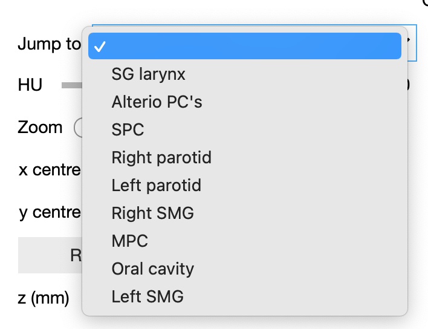

# QuickViewer package

A package for interactively viewing medical image data.

This work was supported by Cancer Research UK RadNet Cambridge [C17918/A28870].

### Table of contents

I) [Installation](#i-installation)

II) [How to use QuickViewer](#ii-how-to-use-quickviewer)

  1) [Basic usage](#1-basic-usage)
  
      - [Saving a QuickViewer plot](#saving-a-quickviewer-plot)
      - [Displaying multiple images](#displaying-multiple-images)
      - [Orthogonal view](#orthogonal-view)
      - [More display settings](#more-display-settings)
      - [Viewing a NumPy array](#viewing-a-numpy-array)


  2) [Image comparisons](#2-image-comparisons)

  3) [Dose fields](#3-dose-fields)

  4) [Masks](#4-masks)

  5) [Structures](#5-structures)

      - [Customising structure names and colours](#customising-structure-names-and-colours)
      - [Loading multiple sets of structures with the same names](#loading-multiple-sets-of-structures-with-the-same-names)
      - [Loading multiple structure masks from one file](#loading-multiple-structure-masks-from-one-file)
      - [Viewing geometric information](#viewing-geometric-information)
      - [Structure comparisons](#structure-comparisons)
      - [Masking out dose field](#masking-out-dose-field)


  6) [Image registration tools](#6-image-registration-tools)

      - [Jacobian determinant](#jacobian-determinant)
      - [Deformation field](#deformation-field)
      - [Visualising deformation with a grid](#visualising-deformation-with-a-grid)
      - [Applying manual translations](#applying-manual-translations)


  7) [Time series](#7-time-series)

  8) [Usage outside Jupyter](#8-usage-outside-jupyter)

      - [From the command line](#from-the-command-line)
      - [Inside a python script](#inside-a-python-script)

III) [Acknowledgements](#acknowledgements)

## I) Installation

### Installing QuickViewer via pip

To install QuickViewer via [pip](https://pypi.org/project/pip/), run the following command from a terminal:
```
pip install git+https://github.com/hpullen/quickviewer.git
```
QuickViewer is continually being developed, so make sure to check for updates often! QuickViewer can be updated with the command:
```
pip install --upgrade git+https://github.com/hpullen/quickviewer.git
```
If you wish to uninstall quickviewer, simply run:
```
pip uninstall quickviewer
```
### Setting up Jupyter notebooks

QuickViewer works best inside a Jupyter notebook; see [here](https://jupyter.org/install.html) for installation instructions. Once you have Jupyter notebooks installed, you need to run the following command once to ensure that QuickViewer's widgets will work:
```
jupyter nbextension enable --py widgetsnbextension
```
Now you can launch a Jupyter server using
```
jupyter notebook
```
in which you can enjoy QuickViewer and its widgets!

## II) How to use QuickViewer

### 1. Basic usage

QuickViewer can be used to view medical images in [DICOM](https://www.dicomstandard.org/) or [NIfTI](https://nifti.nimh.nih.gov/) format, or [NumPy arrays](https://numpy.org/doc/stable/reference/generated/numpy.array.html).

To use QuickViewer, first import the QuickViewer class:
```
from quickviewer import QuickViewer
```
and then create a QuickViewer instance, giving the path to your file. For example, to view a NIfTI file:
```
QuickViewer("my_file.nii")
```
This will launch a viewer that looks something like this:


The widgets can be used to change
- The image orientation (x-y = axial view; y-z = sagittal view; x-z = coronal view)
- The range of Hounsfield Units to cover;
- The position of the slice currently being displayed.

DICOM files can be loaded in a similar way. In cases where there are multiple DICOM files per image, you can either give:
- The path to the directory containing these files; all DICOM files in the directory will be loaded.
- The path to any of the DICOM files in the image series; all files in the same directory that have the same series UID will be loaded.

For example, if there are multiple DICOM files in a directory, one of which is called `1.dcm`, you could run:
```
QuickViewer("1.dcm")
```
to display all of the slices in that series.

#### Saving a QuickViewer plot

QuickViewer plots (minus the widgets) can be saved to an image file by providing the extra argument `save_as` when QuickViewer is called:
```
QuickViewer("my_file.nii", save_as="output_image.pdf")
```
The file `output_image.pdf` will automatically be created when this command is run. When QuickViewer is run with the `save_as` option, an extra widget will appear below the image:


This can be used to overwrite the original output file after some changes have been made via the other widgets, or to save the image to a different file.

#### Displaying multiple images

To show multiple images side-by-side, you can give QuickViewer a list of filepaths rather than a single path:
```
QuickViewer(["my_file.nii", "another_file.nii"])
```
The result will look something like this:


If the two images are in the same frame of reference, they will automatically share their HU and position sliders, so that you can scroll through both simultaneously. This behaviour can be turned off with the `share_slider` argument:
```
QuickViewer(["my_file.nii", "another_file.nii"], share_slider=False)
```

#### Orthogonal view

An orthogonal view of the image can be displayed alongside the main view, with an indicator to show where in the image the current slice is. This option is accessed by running:
```
QuickViewer("my_file.nii", orthog_view=True)
```
For example, when viewing in the x-y (axial) orientation, the y-z (sagittal) view will be displayed:


#### More display settings

##### Initial QuickViewer config

By default, QuickViewer will show the central slice of the axial plane, with the HU range set to `-300 -- 200`. These initial settings can be changed via the arguments:
- `init_view`: set this to `x-y`, `y-z`, or `x-z` to set initial orientation (default = `x-y`);
- `init_pos`: initial slice position in mm (will be rounded to the nearest slice;
- `hu`: set this to a pair of values (e.g. `hu=[-500, 500]`) to set the initial HU range.

To show scales in terms of voxel numbers rather than mm, run QuickViewer with the argument `scale_in_mm=False`. The initial slice position can be set via the `init_sl` argument.

##### More Housfield Unit options

To define the HU range in terms of a central value and window width, rather than minimum and maximum values:
- Set the `hu` argument to a single value, which will be taken as the window centre;
- Optionally set the `hu_width` argument to change the initial window width (default = 500).
Both the HU centre and HU width can be change later via widgets.

The full range of available HU values can also be adjusted by changing the `hu_limits` argument (default = `[-2000, 2000]`); changing this might be useful if you're viewing an image with a much smaller range of intensities.

##### Custom titles

To give your plot a custom title, set the `title` argument:
```
QuickViewer("my_file.nii", title="A CT scan image")
```
When viewing multiple images, multiple titles can be set by providing a list:
```
QuickViewer(["file1.nii", "file2.nii"], title=["First image", "Second image"])
```

##### Zooming, panning and downsampling

If QuickViewer is run with the setting `zoom_ui=True`, extra widgets for zooming and panning will be displayed.

To set the initial zoom level and image centre (regardless of whether `zoom_ui` is set), use:
- `zoom`: set to either a single value for zoom in all directions, or to a list of 3 values for the zoom level in each orientation.
- `zoom_centre`: centrepoint of the image, if zooming is used. This should be a list containing the x, y, and z coordinates of the desired centre.

For large images, you may sometimes wish to downsample for speed. This can be done via the `downsample` parameter; similar to the `zoom` parameter, this can either be a single value setting the downsampling factor to be equal in all directions, or a list of three values for each direction.

E.g. to downsample the x and y directions each by a factor of 3, while leaving z the same:
```
QuickViewer("image.nii", downsample=[3, 3, None])
```

##### Other display options

There are  several options for fine-tuning the appearance of the plot:
- `colorbar`: show a colorbar for the HU grayscale.
- `figsize`: sets the figure height in inches (default = 5 inches).
- `xlim`/`ylim`/`zlim`: set these to a pair of values to specify custom `x`, `y`, or `z` limits (i.e. to crop the plot).
- `plots_per_row`: maximum number of images to display per row, when using multiple images; this allows images to be spread over multiple rows.
- `major_ticks`: sets the interval between major axis tick marks.
- `minor_ticks`: sets the number of minor tick marks to display between each pair of major tickmarks (by default, no minor ticks are shown).
- `ticks_all_sides`: if set to True, tick marks will be shown at the top and right-hand side of plots as well as the bottom and left-hand side.

#### Viewing a NumPy array

QuickViewer can be used to view NumPy arrays as well as NIfTI images. This is done by giving the array in place of the NIfTI filepath:
```
import numpy
my_array = numpy.random.rand(512, 512, 40)
QuickViewer(my_array)
```
By default, QuickViewer will set the origin to `(0, 0, 0)` and the voxel sizes in all directions to 1mm. This can be changed either by providing the `voxel_sizes` and `origin` arguments (which should be lists in order `(x, y, z)`) or by giving an affine matrix via the `affine` argument, e.g.:
```
QuickViewer(my_array, voxel_sizes=[2.5, 2.5, 4], origin=[-200, -300, 0])
```

### 2. Image comparisons

If two images are loaded into QuickViewer they can be compared in an additional plot. To do this, set the `comparison` argument to `True`, e.g.:
```
QuickViewer(["image1.nii", "image2.nii"], comparison=True)
```
This will give the following output:


The "comparison" dropdown menu allows you to switch the comparison type between:
- Chequerboard image
- Red/blue overlay
- Difference image (relative or absolute)
- Distance-to-agreement
- Gamma index

The initial number of panes in the chequerboard image can be set via the `cb_splits` argument, and can later be changed via the slider. Similarly, the initial overlay opacity can be set via the `overlay_opacity` and later change via a slider. 
The order of the images to be compared can be changed by checking the "invert" box.

To display only the comparison image, set `comparison_only` to `True`.

To display individual comparison types side-by-side, a list of the desired types (any from "chequerboard", "overlay", "difference", and "all") in the desired order should be passed to the `comparison` argument.

For example, to plot all three comparison images without plotting the separate images themselves, run:
```
QuickViewer(["image1.nii", "image2.nii"], comparison=["chequerboard", "overlay", "difference"], comparison_only=True)
```
to give the following output:


#### Distance-to-agreement, gamma index, and mean-squared error

The distance-to-agreement and gamma index comparison images are computed on a slice-by-slice basis. This can be slow for slices with high resolutions, therefore these options are best used in combination with [downsampling](#zooming-panning-and-downsampling). 

For example, to downsample an image by a factor of 8 and view the distance-to-agreement, you could run:
```
QuickViewer(["image1.nii", "image2.nii"], comparison=True, comparison_only, downsample=8, hu=[0, 50])
```
and then select "distance to agreement" from the comparison dropdown menu:


Values used in the calculation of the distance-to-agreement and gamma index can be set via the following arguments when launching a QuickViewer instance:
- `dta_tolerance`: tolerance used in distance-to-agreement calculation.
- `dta_crit`: critical distance-to-agreement used in gamma index calculation.
- `diff_crit`: critical difference used in gamma index calculation.

To print the mean squared error on the comparison plot, set the `show_mse` parameter. This can either be set to `True`, in which case the default font colour (white) will be used, or to any valid `matplotlib` colour to set a custom font colour.

### 3. Dose fields

Dose fields can be overlaid on top of images by setting the `dose` parameter to the path to a DICOM/NIfTI file or array the same shape as the image, e.g.
```
QuickViewer("image.nii", dose="dose.nii", colorbar=True)
```
will give:


Note that setting the `colorbar=True` option will draw a colorbar for the dose field as well as the intensity of the underlying image.

The initial opacity of the dose field can be specified via the `dose_opacity` argument or adjusted later via the slider.

By default, the range of the dose colorscheme will be set automatically based on the contents of each slice. To fix it to a set range, use the `dose_range` parameter, e.g.
```
QuickViewer("image.nii", dose="dose.nii", dose_range=[0, 60], colorbar=True)
```
will fix the colorbar to go from 0 -- 60 on every slice.

#### Dose fields on multiple images

When multiple images are loaded but only one dose path is given, the dose field will only be overlaid on the first. Dose fields can be set for multiple images by giving setting `dose` parameter to a list the same length as the list of images, containing the desired dose field for each. To skip an image, put `None` in this list.

For example, to load two images and overlay a dose field on the second only:
```
QuickViewer(["image1.nii", "image2.nii"], dose=[None, "dose2.nii"])
```

#### Dose comparisons

TBC

### 4. Masks

QuickViewer can apply a mask in a NIfTI file or array to an image. To do this, pass the NIfTI path or NumPy array to the `mask` argument; for example, if the file `mask.nii` contained an array with zeroes at the upper and lower ends of the z axis, we could run the following command:
```
QuickViewer("image.nii", mask="mask.nii", init_view="y-z", mask_color="blue)
```
which would give:


The mask can be turned on or off using the "apply mask" checkbox.

Some additional options for masks are:
- `mask_color`: sets the color of masked regions.
- `mask_threshold`: sets the threshold of voxels in the mask array which should be masked out.
- `invert_mask`: mask out voxels below the threshold rather than above it.
- Multiple masks for multiple images are loaded in the same way as multiple dose fields ([see above](#dose-fields-on-multiple-images))

### 5. Structures

Structures can be loaded from DICOM or NIfTI files and overlaid on the image. The path to the structure file(s) is set via the `structs` argument. This can either be:
- The path to a single DICOM structure set file;
- The path to a single NIfTI structure mask file;
- The path to a directory containing multiple NIfTI files;
- A wildcard path matching one or more NIfTI files;
- A wildcard path to one or more directories containing NIfTI files.

To load structures for multiple images, these options should be nested inside a list the same length as the list of images.

For example, to load all of the structures in a directory called `structures`, you could run:
```
QuickViewer("image.nii", structs="structures", struct_legend=True)
```
which gives the following output:


The names of structures are inferred from:
- Their names within the structure set, if using a DICOM structure file;
- Their filenames, if using NIfTI structure mask files. 

Colours are automatically assigned to each, either from the DICOM structure set (if applicable) or from a default sequence of colours if no structure set colours are available.

If you only want to load a subset of structures from the given file(s), you can specify these by name or wildcard in the `structs_to_keep` argument. E.g. to only load the parotid gland structures, you could set `structs_to_keep=["*parotid*"]`. Similarly, you can ignore certain structures by name or wildcard with the `structs_to_ignore` argument.

By default, the extra zooming widgets are loaded when structures are used; to turn this behaviour off, set `zoom_ui=False`. The legend drawn on the plot can also be turned off by omitting the `struct_legend=True` argument.

An extra widget will appear below the plot, listing all loaded structures and their colors, and allowing the user to remove structures from the plot by unchecking the corresponding checkbox:


To quickly navigate between structures within the image, the "jump to" dropdown menu can be used to jump to the central slice of any of the loaded structures:



If you have zoomed in using the zoom slider, the image will also be centred on the selected structure.

The "Structure plotting" dropdown menu can be used to change the structure plotting method. The options are:
- "contour" (default): plot a contour around the edge of the structure. Its linewidth can be adjusted via a slider.
- "mask": fill all voxels inside the structure. Its opacity can be adjusted via a slider.
- "filled": plot a semi-transparent mask with an opaque contour on top; both linewidth and opacity can be adjusted.
- "centroid": plot a contour and a cross at the centre-of-mass of the contour on the current slice.
- "filled centroid": the same as "filled", plus a cross at the centre-of-mass of the contour on the current slice.
- "none": turn off all structure plotting.

Some additional structure plotting arguments are:
- `struct_plot_type`: set the initial structure plotting type to any of the options listed above.
- `struct_opacity`: set the initial opacity of structure masks.
- `struct_linewidth`: set the inital linewidth of structure contours.
- `ignore_empty_structs`: if `True`, any loaded NIfTI files that contain an empty array will be ignored and the corresponding structures will not be listed in the UI. Otherwise, these structures will be loaded but will be displayed with "(empty)" next to their names.

#### Customising structure names and colours

The default structure naming and coloring behaviours of QuickViewer can be overridden using the `struct_names` and `struct_colors` arguments.

Structure names are set using a dictionary, where the keys are the desired names and the values are potential structures for which you wish that name to be assigned; this can be a single structure name, a wildcard, or a list of multiple structure names or wildcards. These structure names will be checked for matches first with the structure names that are automatically inferred from the DICOM structure sets or NIfTI filename (e.g. for a file called "parotid.nii", the structure name would be "parotid"), and are then compared to the path of the structure file if no name match is found.

For example, to ensure that structures whose names contain any of the strings "spinal", "spine", or "cord" are named "spinal cord" in QuickViewer:
```
my_struct_names = {
  "spinal cord": ["*spine*", "*spinal*", "*cord*"]
}
QuickViewer("image.nii", structs="structures", struct_names=my_struct_names)  
```
Any loaded structures that do not match any of the values in the `struct_names` dictionary will keep their default assigned names.

Structure colours can be set using a dictionary whose keys are structure names or wildcards matching structure names and whose values are any valid `matplotlib` colour. For example, to set any structures with "left" in their names to green, and any with "right" in their names to red:
```
QuickViewer("image.nii", structs="structures", struct_colors={"left*": "green", "right*": "red"})
```

Any loaded structures whose names do not match the dictionary keys will keep their default assigned colours.

#### Loading multiple sets of structures with the same names

You may wish to loaded multiple structures with the same names; for example, to plot the same structures drawn by two different observers. When QuickViewer loads structures with duplicate names, it will attempt to label them according to the differences in their filepaths, e.g. with their parent directory. For example, if the directory `structure` contained two subdirectories, `observer1` and `observer2`, each containing the same structures, both sets could be loaded using:
```
QuickViewer("rectum.nii", structs="structures/*", struct_legend=True)
```
The output would look like this:


QuickViewer has appended the directory names to the structures listed in the user interface, so that you can distinguish between them. However, these extra labels do not appear in the structure legend by default.

To gain more control over the labelled of identically-named structures, and to include these labels in the legend, the `structs` argument can instead be a dictionary containing the desired labels and paths of the sets of structures. For example:
```
my_structure_sets = {
    "Clinician 1": "structs/observer1",
    "Clinician 2": "structs/observer2"
}
QuickViewer("prostate.nii", structs=my_structure_sets, struct_legend=True)
```
would give:


The user-defined labels are now appended to each structure name in both the user interface and the plot legend. 

The `struct_names` and `struct_colors` parameters can also be dictionaries containing options for each structure set label, allowing you to fine-tune the settings for each structure set. E.g. to set custom colours for the structure sets loaded above, you could use:
```
struct_names = {"Clinician 1": {"rectum": "cyan"}, "Clinian 2": {"rectum": "purple"}}
QuickViewer("prostate.nii", structs=my_structure_sets, struct_legend=True, struct_colors=struct_colors)
```

#### Loading multiple structure masks from one file

As well as loading a single structure from a single NIfTI file, QuickViewer can load a NIfTI file containing multiple structure masks, each labelled with a different number. There are two ways to tell QuickViewer to load a structure file in this way:
- Provide the structure filepath via the `multi_structs` argument;
- Add the string `"multi:"` in front of the filepath.

E.g. to load multiple structures from a file `many_struct_masks.nii`, you could either run:
```
QuickViewer("image.nii", multi_structs="many_struct_masks.nii")
```
or
```
QuickViewer("image.nii", structs="multi:many_struct_masks.nii")
```

By default, these will be labelled according to their numerical order in the file (Structure1, Structure2, etc). Custom names can be set by providing the `struct_names` argument as either a list, containing the desired names in the numerical order they appear in the file, or a dictionary where the keys are the structure labels in the file and the values are the desired names.

For example, let's say the file `many_struct_masks.nii` contains the left parotid gland, right parotid gland and spinal cord, with voxels labelled `1`, `2` and `3`, respectively. The `struct_names` parameter should be set to either:
```
struct_names=["left parotid", "right parotid", "spinal cord"]
```
or 
```
struct_names={1: "left parotid", 2: "right parotid", 3: "spinal cord"}
```

#### Viewing geometric information

To display a table containing geometric information about each structure, set `struct_info=True`. The table will be displayed below the plot:


This contains the following information:
- Overall information:
  - Total structure volume
  - Total structure extent in each direction
- Slice-by-slice information:
  - Structure area on current slice
  - Extent along the two plotted axes on the current slice

The slice-by-slice information will be updated whenever the slice slider or orientation is changed. The slice-by-slice cells will be blank if the structure does not appear on the current slice.

The structure information table can be saved to either a `.csv` or a `.tex` file using the widgets below the table. The "Metrics to save" dropdown menu allows you to choose whether to save all of the information, only the overally structure information, or only the information for the current slice. The `.tex` file can be compiled in LaTeX as long as the `booktabs` package is imported into the LaTeX document.

The table can be customised with the following settings:
- `vol_units`: set the units for the volume (`"mm3"`, `"ml"` or `"voxels"`)
- `area_units`: set the units for the area (`"mm2"` or `"voxels"`)
- `length_units`: set the units for the extents (`"mm"` or `"voxels"`)
- `struct_info_dp`: set the number of decimal places to use in the table (default = 2)

#### Structure comparisons

QuickViewer can compute and display metrics for comparing structures. This behviour is turned on by setting `compare_structs=True`. Structures can be grouped for comparison in three ways:
1. **Pairwise comparison**: every structure will be compared to every other structure. This is the default behaviour when QuickViewer loads multiple structures each with different names. This mode can also be forced by setting `comp_type="pairs"`. Note that this option is best used with a small number of structures to avoid lag.
2. **Comparison by name**: When QuickViewer finds pairs of structures with the same name, it will automatically pair them up for comparison. This can be useful when loading multiple structure sets (as described [here](#loading-multiple-sets-of-structures-with-the-same-names). You can also ignore any structures without a matching pair by setting `ignore_unpaired_structs=True`.
3. **Comparison to consensus of others**: To compare large numbers of structures, it can be best to compare each one to the consensus of all of the others. This behaviour is turned on by setting `comp_type="others"`.

For example, a pairwise structure comparison table could be loaded via
```
my_structs = ["structure_1.nii", "structure_2.nii", "structure_3.nii"]
QuickViewer("image.nii", structs=my_structs, compare_structs=True)
```
and would give an output that looks like this:


This table containts the following comparison metrics:
- Overall:
  - Dice score of the 3D structures;
  - Relative volume difference;
  - Absolute distance between centroids in 3D;
- Slice-by-slice:
  - Dice score of the 2D structures on the current slice;
  - Relative area difference on the current slice;
  - Distance between centroid along the two axes displayed on the current slice.

The structure comparison table can be saved to a `.csv` or `.tex` file in the same way as the structure info table.

When the `comp_type="others"` option is set (to compare each structure to the consensus of all others), some extra widgets will appear:
```
QuickViewer("image.nii", structs=my_structs, compare_structs=True, comp_type="others")
```


Two extra dropdown menus control the comparison type and plotting method:
- "Comparison plotting": change the plotting type. The options are:
    -  "individual": plot each structure separately.
    -  "group others": plot the consensus of other contours as a single, white contour. When this options is selected, the coloured structure can be changed by selecting a different structure from the "Jump to" menu. Setting this option will also limit the structure comparison table to just show the selected structure vs. the consensus.
-  "Comparison type": change the way in which the consensus is computed. The options are:
    -  "majority vote": take voxels which fall within at least half of the contours.
    -  "sum": add together the contours.
    -  "overlap": take the region contained within all contours.

Individual structures can be removed from the consensus by unchecking them with the checkboxes below the structure comparison table.

#### Masking out dose field

When both a structure set and a dose field are overlaid on the same image, the argument `structs_as_mask=True` can be set; this allows you to mask out the dose field outside the structures, allowing you to examine the dose distribution inside structures. For example:
```
QuickViewer("image.nii", structs="tumour.nii", dose="dose.nii", structs_as_mask=true, dose_opacity=1)
```

The masking can be turned on and off with the "Apply mask" checkbox. Note that the color range of the dose field is recomputed to cover only the range of doses inside the structure when the mask is applied. It can instead be set to a fixed range via the `dose_range` argument.


### 6. Image registration tools

QuickViewer provides several useful functionalities related to displaying the results of an image registration. 

#### Jacobian determinant

A Jacobian determinant file output by image registration software can be overlaid on an image. The path to this file can be set via the `jacobian` parameter:
```
QuickViewer("image.nii", jacobian="jacobianDeterminant.nii", colorbar=True)
```


Note that if `colorbar=True` is set, an extra colorbar will be drawn for the Jacobian determinant field. The initial opacity can be set via `jacobian_opacity` and changed via a slider. The colorbar range (default 0.8 -- 1.2) can also be adjusted via a slider.

#### Deformation field

Deformation fields output by image registration software can be loaded via the `df` argument and plotted as a "quiver" or "grid" plot. E.g.
```
QuickViewer("image.nii", df="deformationField.nii", df_plot_type="quiver)
```


Additional settings for deformation field plotting:
- The initial plot type (`"grid"` or `"quiver"`) can be set via `df_plot_type` or changed via the dropdown menu.
- The spacing between gridpoints (in mm) can be set via the `df_spacing` argument; this can be either a single value, or a list of three values, one for each of the (x, y, z) directions.
- Custom plot settings can be adjusted via `df_kwargs`; this should be a dictionary of valid `matplotlib` arguments for the chosen plot type ([quiver](https://matplotlib.org/stable/api/_as_gen/matplotlib.pyplot.quiver.html) or [grid](https://matplotlib.org/stable/api/_as_gen/matplotlib.pyplot.plot.html)). For example, to change the color and linewidth of the lines on a grid plot:
```
QuickViewer("image.nii", df="deformationField.nii", df_plot_type="grid", df_kwargs={"linewidth": 3, "color": "red"})
```


#### Visualising deformation with a grid

The deformation of the moving image when it is transformed can be visualised by creating a regular grid the same shape as the moving image, and then deforming it to match the shape of the transformed image.

A script to create the initial regular grid images can be found in `bin/make_grids.py`. This can be run using:
```
python make_grids.py moving_image.nii grids -t 3 --nx 10
```
This would produce three NIfTi files in the directory "grids", one for each orientation. The arguments for this script are:
- `"moving_image.nii"` is the path to the moving image file (used to determine the shape and size of the grid images).
- `"grids"`: the path to the output directory in which to put the grid files.
- `"-t 3"`: set the thickness of gridlines in voxels.
- `"--nx 10`: the number of squares to make in the grid in the x direction (other directions will be set from this, such that the boxes of the grid have the same sidelengths).

The three regular grid files should then be transformed using your preferred image transformation software.

The transformed grids can be visualised on top of the transformed image in QuickViewer by setting them as masks. The `mask` parameter can be a dictionary, where the keys are the three orientations ("x-y", "y-z and "x-z") and the values are the paths to the transformed masks for each orientation. The `invert_mask` option should be set, so that voxels containining gridlines are masked.

E.g. if your transformed grid images were in the files "final_grid_x-y.nii" etc, you should run:
```
mask_dict = {"x-y": "final_grid_x-y.nii",               
             "y-z": "final_grid_y-z.nii",              
             "x-z": "final_grid_x-z.nii"}
QuickViewer("final_image.nii", mask=mask_dict, invert_mask=True, mask_color="green")
```
which would look like this:


#### Applying manual translations

When two images are loaded in QuickViewer, you can turn on the ability to apply a manual translation to the second image. This is useful in combination with a comparison image, in particular the "overlay" option. E.g.:
```
QuickViewer(["image1.nii", "image2.nii"], translation=True, comparison="overlay")
```
gives the following output:


The three translation sliders can be used to translate the second image by an integer number of voxels in each direction. The translation sizes in mm can then be written to a file.

### 7. Time series

QuickViewer can load a series of scans of the same shape taken at different points in time. You can then scroll through these images with a time slider. A timeseries of images can be specified to the `timeseries` argument in two ways:
- A wildcard pointing to multiple directories containing the images, where the directory names contain a string that can be interpreted as a date;
- A dictionary with keys that are strings that can be interpreted as dates, and values that are paths to images for those dates.

Dated structures can also be provided in the same way.

For example, if we have a directory "scans" containing a subdirectory with an image file inside for each date, and another directory "structures" containing a subdirectory with structures inside for each date, we could run:
```
QuickViewer(timeseries="scans/*", structs="structs/*")
```
to get:


The "Time point" slider can be used to scroll between the images, in order of date. The dates are displayed as the titles of the images.

### 8. Usage outside Jupyter

#### From the command line
1. A script for creating a quickviewer plot from the command line can be found in `quickviewer/bin/quick_view.py`. The basic usage for viewing a NIfTI file is:
```quick_view.py <filename>```.
2. To see the available input options for this script, run:
```quick_view.py -h```
3. Running this script will create a figure in a seperate window, which can be interacted with using the following commands:
    - **scroll wheel**: scroll through image one slice at a time
    - **left/right arrows**: scroll through image one slice at a time
    - **up/down arrows**: scroll through image five slices at a time
    - **v**: switch orientation
    - **d**: change dose field opacity
    - **m**: turn masks on and off
    - **c**: toggle structure plotting type between contours, masks, and none
    - **j**: jump between the structures on the image
    - **i**: invert any comparison images
    - **o**: change the opacity of overlay comparison image

#### Inside a python script
The `QuickViewer` class can be imported into a python script by adding
```from quickviewer import QuickViewer```
to the script. Creating a `QuickViewer` object inside the code will cause a window containing the plot to be opened when the code is run.

If you just want to save the plot without interactively displaying it, you can set the `save_as` argument to the output file name, and set `show=False` to suppress the interactive version.

## Acknowledgements
Many thanks to Karl Harrison and Ceilidh Welsh for code snippets, feature suggestions, and rigorous testing!
